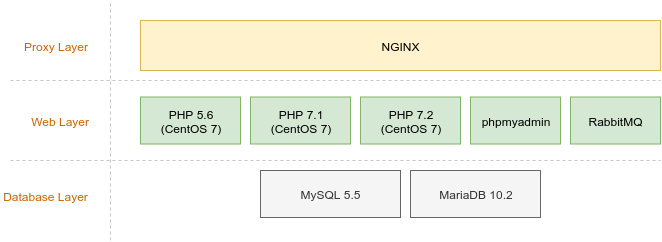

# OrangeHRM Development Environment
    

## Introduction
orangehrm-dev-environment is a dockerized development environment for [OrangeHRM](https://www.orangehrm.com/). This dev environment mainly contains three layers as follows,

- Proxy Layer 
- Web Layer
- Database Layer

Configurations in each layer have been added according to the OrangeHRM application requirements.

## Prerequisites
- Docker engine installed.([Get docker](https://docs.docker.com/engine/installation/))
- Minimum docker version 17.3
- Minimum docker-compose version 1.12. ([Get docker compose](https://docs.docker.com/compose/install/))

## Architecture

## How to use ?

The Dev environment has been configured to use **443** port as the default web port. So make sure that the 443 port of your host machine is been used by none of the other services (eg:- apache, tomcat, nginx, etc). 
##### Installation

1. Download the zip
2. Extract the zip anywhere you want
3. run the command `docker-compose up -d`. This will up the basic OrangeHRM dev environment (PHP 5.6, PHP 7.1, PHP 7.2, nginx, phpmyadmin, RabbitMQ, MySQL 5.5 and MariaDB 10.2 containers).
4. For a customized docker development environment, See the section "How to use custom containers?".

##### Host an instance
After the installation add below URLs to your /etc/hosts file.
- phpmyadmin.orangehrmdev.com
- rabbitmq.orangehrmdev.com

###### Enterprise Hosting
- You can **NAME** your instance directory as you like (Please do not use **SPACES**)
- Document Root: /var/www/html/OHRMStandalone/TEST
- Use different environments 
  - web56: **NAME**.test-web56.orangehrmdev.com
  - web71: **NAME**.test-web71.orangehrmdev.com
  - web72: **NAME**.test-web72.orangehrmdev.com
  - web73: **NAME**.test-web73.orangehrmdev.com
  
###### Opensource Hosting
- You can **NAME** your instance directory as you like (Please do not use **SPACES**)
- Document Root: /var/www/html/OHRMStandalone/OPENSOURCE
- Use different environments 
  - web56: **NAME**.os-web56.orangehrmdev.com
  - web71: **NAME**.os-web71.orangehrmdev.com
  - web72: **NAME**.os-web72.orangehrmdev.com
  - web73: **NAME**.os-web73.orangehrmdev.com

Replace the **NAME** with any name you want for your instance.

## Containers

| Container Name   | Service Name in docker-compose.yml | Description    | IP Address | Ports (Inside the Container) | Ports (Host Machine)|
|------------------|------------------------------------|----------------|------------|------------------------------|---------------------|
| nginx            | nginx                              | PHP 5.6        | 10.5.2.1   | 443                          | 443                 |
| dev_web_56       | web56                              | PHP 5.6        | 10.5.0.56  | 443                          | -                   |
| dev_web_71       | web71                              | PHP 7.1        | 10.5.0.71  | 443                          | -                   |
| dev_web_72       | web72                              | PHP 7.2        | 10.5.0.72  | 443                          | -                   |
| dev_web_73       | web73                              | PHP 7.3        | 10.5.0.73  | 443                          | -                   |
| dev_web_74       | web74                              | PHP 7.4        | 10.5.0.74  | 443                          | -                   |
| dev_web_74_rh    | web74rh                            | PHP 7.4        | 10.5.0.174 | 443                          | -                   |
| dev_mysql_57     | db57                               | MySQL 5.7      | 10.5.1.57  | 3306                         | -                   |
| dev_mariadb_102  | db102                              | MariaDB 10.2   | 10.5.1.102 | 3306                         | -                   |
| dev_mariadb_10114| db10114                            | MariaDB 10.11.4| 10.5.1.122 | 3306                         | -                   |
| dev_mariadb_10117| db10117                            | MariaDB 10.11.7| 10.5.1.117 | 3306                         | -                   |
| dev_phpmyadmin   | phpmyadmin                         | phpMyAdmin     | 10.5.2.2   | 80                           | -                   |
| dev_rabbitmq     | rabbitmq                           | RabbitMQ 3.6   | 10.5.2.3   | 15671,5671                   | 15671               |

## How to add custom PHP configurations
- Add custom PHP configurations to the file **./config/<WEB_CONTAINER>/php/custom_php.ini**. And then reload the apache service (inside the relevant container). **WEB_CONTAINER** can be web71, web72, web56 ,etc.

## How to run composer update - inside a web container
Use following command if you want to run composer install/update

`php -d allow_url_fopen=on /usr/local/bin/composer install`

## How to use custom containers?
- Compose files for custom containers have been located under ./custom-compose directory. Run `php env-start.php` and select the "Custom Environment" option. Then select the containers you need as you wish (Use **ARROW_KEYS** to move up and down and press **SPACE** to do the selection. And press **ENTER** to continue.).
 
- Available custom containers
   - db55 - MySQL 5.5
   - db56 - MySQL 5.6
   - ldap - openldap and phpldapadmin
   - mariadb103 - MariaDB 10.3
   - mongodb - mongo DB Database
   - oracle11 - Oracle 11 Database
   - ubuntuweb71 - Ubuntu 18.04 PHP 7.1 container
   - web 54 - CentOS 7 PHP 5.4 container
   - web 70 - CentOS 7 PHP 7.0 container
   - web 74 - CentOS 7 PHP 7.4 container
   - web 74 rh - RedHat 8 PHP 7.4 container
   - xhgui - XhGUI profiling tool
  
- Moving from custom version to basic version -  `docker-compose up -d --remove-orphans`
